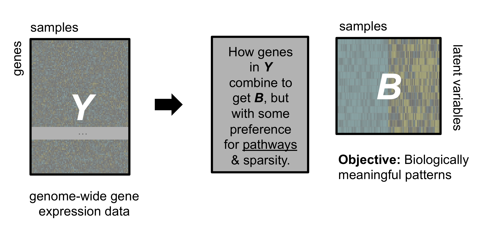

_Adapted from Childhood Cancer Data Lab, Alex's Lemonade Stand Foundation [training materials](https://github.com/AlexsLemonade/training-modules/tree/ddc9c76e03aaf147fb2f011490ea6aec835de064)._

## Background

Before we get into it, let's briefly cover some concepts. 

**Dimension reduction** (also called dimensionality reduction) is any technique that reduces the number of features or dimension in a dataset. 
A dimension in our high-dimensional space is the measurement of an individual gene in our RNA-seq data in our particular case.
Dimension reduction can come about through _feature elimination or feature selection_, where we remove features or variables if they are unlikely to give us meaningful information (or are redundant with other variables). 
Or we can use _feature extraction_, where we form new features from the input data.
(See [Freytag (2019)](https://rpubs.com/Saskia/520216) and [Raj (2019)](https://towardsdatascience.com/dimensionality-reduction-for-machine-learning-80a46c2ebb7e).)

In general, the idea behind dimension reduction, as we'll cover it in this notebook, is that we want to transform our input data into a low-dimensional representation that retains some of the meaningful structure (_feature extraction_). 

If we want to get the sense of the overall structure in our dataset, sometimes we want the following:


**Representation learning** (also called feature engineering or feature learning) is any technique that automatically detects representations from input data. 
We'll cover unsupervised methods like matrix factorization here, but supervised methods like supervised neural networks are examples of representation learning, too.

When we're working with gene expression data, often what we want is the following:


We may want to use these representations in a semi-supervised manner, where we learn representations from a collection of data without labels and then use them to encode a low-dimensional representation of data with labels that we then use for prediction.

## Set up

```{r}
# Set seed for reproducibility
set.seed(2020)
```

### Libraries

```{r}
library(tidyverse)
# UMAP implementation
library(uwot)
# t-SNE implementation
library(Rtsne)
```
### Files

```{r}
clinical_file <- file.path("data", "pbta-medullo-histologies.tsv.gz")

# Processed RNA-seq data
rnaseq_file <- file.path("data", "pbta-medullo-vst-collapsed.tsv.gz")

# Pathway-Level Information ExtractoR model we've prepared ahead of time
plier_file <- file.path("models", "pbta-medullo-plier.RDS")
```


## Read in data

Read in our transformed RNA-seq data.

```{r}
rnaseq_df <- read_tsv(rnaseq_file)
```

For the applications in this notebook, we'll transpose RNA-seq data.

```{r}
rnaseq_mat <- rnaseq_df %>%
  column_to_rownames("gene_symbol") %>%
  as.matrix() %>%
  t()
```

Because we are interested in the overall structure of our data, we're going to subset the matrix to features with high variance moving forward.
Eliminating features that *don't* vary within themselves and therefore are less likely to contribute to the overall structure in our data that we are most interested in.
Fewer features is appealing from a computational resource standpoint!

```{r}
# Genes are now columns
gene_variance <- matrixStats::colVars(rnaseq_mat)
# We'll want to retain the top 10%
variance_threshold <- quantile(gene_variance, 0.9)
# Filter to top 10%
high_var_mat <- rnaseq_mat[, gene_variance > variance_threshold]
```

Read in our clinical metadata file.

```{r}
clinical_df <- read_tsv(clinical_file)
```

For the most part, we'll only use the molecular subtype information from the clinical meatadata.

```{r}
subtype_df <- clinical_df %>%
  select(Kids_First_Biospecimen_ID, molecular_subtype)
```


## Dimension reduction

_Adapted from [CCDL scRNA-seq dimension reduction](https://htmlpreview.github.io/?https://github.com/AlexsLemonade/training-modules/blob/2020-july/scRNA-seq/05-dimension_reduction_scRNA-seq.nb.html) and [Dimensionality Reduction concepts](https://alexslemonade.github.io/2020-july-training/supplemental_notebooks/2020-07-29_dimensionality_reduction.nb.html)_

### Principal Components Analysis (PCA)

Principal components analysis (PCA) is a dimensionality reduction technique that captures the main sources of variation in our data in the first two principal components (PC1 and PC2).
PCA applies linear algebra to find the axis of greatest variation in the data matrix, then the axis perpendicular to that with the most remaining variation, then the one perpendicular to those with the most remaining, etc.

```{r}
# PCA
pca_results <- prcomp(high_var_mat, scale = TRUE)

# Join the first two PCs with the subtype labels for plotting purposes
pca_df <- data.frame(pca_results$x[, 1:2]) %>%
  rownames_to_column("Kids_First_Biospecimen_ID") %>%
  inner_join(subtype_df, by = "Kids_First_Biospecimen_ID")

# Create a plot of the first two PCs
ggplot(pca_df,
       aes(x = PC1, 
           y = PC2,
           color = molecular_subtype)) +
  geom_point(alpha = 0.75) +
  colorblindr::scale_color_OkabeIto() +
  theme_bw()
```

PCA can sometimes produce results where the points occupy the whole plotting space, which would likely be more pronounced if we had even more samples.

### Uniform Manifold Approximation and Projection (UMAP)

**UMAP** (Uniform Manifold Approximation and Projection) is a machine learning technique designed to provide more detail in highly dimensional data than a typical PCA. 
While PCA assumes that the variation we care about has a particular distribution (normal, broadly speaking), UMAP allows more complicated distributions that it learns from the data. 
We won't go into the underlying mathematics, but you can look at the paper by [McInnes, Healy, & Melville (2018)](https://arxiv.org/abs/1802.03426). 
The main advantage of this change in underlying assumptions is that UMAP can do a better job separating clusters, especially when some of those clusters may be more similar to each other than others.  

Another dimensionality reduction technique that you may have heard of is **t-SNE** (t-distributed Stochastic Neighbor Embedding), which has similar properties to UMAP, and often produces similar results. 
There is some ongoing debate about which of these two techniques is superior for high-dimensional biological data, and whether the differences are due to the underlying algorithm or to implementation and parameter initialization defaults. 
Regardless of why, in our experience, UMAP seems to produce slightly better results in this context and run a bit faster, but the differences can be subtle.

Let's use UMAP with the default parameters and see what the plot looks like!

```{r}
# Run UMAP with default parameters, but perform PCA first and use the specified
# number of PCs. This is recommended for > 100 columns. 50 PCs are often 
# recommended for t-SNE applications, which we'll see in a moment.
umap_results <- uwot::umap(high_var_mat, pca = 50)

# Add the subtype labels to the coordinates returned by uwot::umap
umap_df <- data.frame(umap_results) %>%
  rename(UMAP1 = X1, UMAP2 = X2) %>%
  bind_cols(subtype_df)

# Make a plot that's very similar to the one we made for PC1 and PC2
ggplot(umap_df,
       aes(x = UMAP1, 
           y = UMAP2,
           color = molecular_subtype)) +
  geom_point(alpha = 0.75) +
  colorblindr::scale_color_OkabeIto() +
  theme_bw()
```

Now that we have an idea of what a UMAP plot with the default parameters looks like, let's try experimenting with the `n_neighbors` parameter (number of nearest neighbors). 
This parameter constrains the size of the local neighborhood size when learning the manifold structure. 
Lower values emphasize the local structure of the data ([ref](https://www.rdocumentation.org/packages/uwot/versions/0.1.8/topics/umap)).

In the interest of experimenting with the `n_neighbors` parameter, we've written a wrapper function that will allow us to 

```{r}
# For a given n_neighbor value, run UMAP and make a plot using the coordinates
# it returns with samples colored by their subtype label.
umap_plot_wrapper <- function(n_neighbors_param) {
  
  # Perform UMAP using the specified n_neighbors value
  umap_results <- uwot::umap(high_var_mat, 
                             n_neighbors = n_neighbors_param,
                             pca = 50)

  # Add the subtype labels
  umap_df <- data.frame(umap_results) %>%
    rename(UMAP1 = X1, UMAP2 = X2) %>%
    bind_cols(subtype_df)
  
  # Make a plot that's very similar to the one we made for PC1 and PC2
  ggplot(umap_df,
         aes(x = UMAP1, 
             y = UMAP2,
             color = molecular_subtype)) +
    geom_point(alpha = 0.75) +
    colorblindr::scale_color_OkabeIto() +
    theme_bw()
}
```

Let's start by running UMAP using the same `n_neighbors` value but a different seed.

```{r}
# Set a different seed but use the same n_neighbors
set.seed(1234)
umap_plot_wrapper(n_neighbors_param = 15)
```

For visualization, this difference doesn't change our interpretation, but it's a good idea to run this multiple times with different seeds to make sure you're not getting anomalous results.

Okay, let's try a variety of `n_neighbor` values and see what happens.

```{r}
umap_plot_wrapper(n_neighbors_param = 3)
```

```{r}
umap_plot_wrapper(n_neighbors_param = 30)
```

```{r}
umap_plot_wrapper(n_neighbors_param = 50)
```

### t-Distributed Stochastic Neighbor Embedding (t-SNE)

Like UMAP, t-SNE is nonlinear dimensionality technique that can produce well-separated clusters.

```{r}
# This implementation performs PCA first.
# We are using the default perplexity value here, but like we saw with
# n_neighbors this parameter is highly influential on your results!
tsne_results <- Rtsne::Rtsne(high_var_mat, perplexity = 30)

# Add the subtype labels to the coordinates returned by Rtsne::Rtsne()
tsne_df <- data.frame(tsne_results$Y) %>%
  rename(tSNE1 = X1, tSNE2 = X2) %>%
  bind_cols(subtype_df)

# Make a plot using the coordinates from t-SNE
ggplot(tsne_df,
       aes(x = tSNE1, 
           y = tSNE2,
           color = molecular_subtype)) +
  geom_point(alpha = 0.75) +
  colorblindr::scale_color_OkabeIto() +
  theme_bw()
```

**Some takeaways!**

- Newer methods that learn nonlinear patterns can help us find well-separated clusters, which is handy for visualization.
- The results strongly depend on parameters that balance local structure vs. global structure, so these values should be chosen based on the question on hand and it may be useful to test a range of values.
- The interpretation of these methods may sometimes be counter-intuitive (e.g., distance between clusters).


## A domain-specific dimension reduction technique: Pathway-Level Information ExtractoR (PLIER)

_Adapted from [CCDL OpenPBTA PLIER](https://htmlpreview.github.io/?https://github.com/AlexsLemonade/training-modules/blob/2020-july/machine-learning/03-openpbta_PLIER.nb.html) and [Plotting latent variables](https://htmlpreview.github.io/?https://github.com/AlexsLemonade/training-modules/blob/2020-july/machine-learning/04-openpbta_plot_LV.nb.html) notebooks._

All of the techniques we've seen so far can (can, not should!) be applied to any generic set of data.
Now we will cover a method called Pathway-Level Information Extractor (PLIER) ([Mao *et al.* (2019)](https://doi.org/10.1038/s41592-019-0456-1)).

Let's revisit the example from above and put it in the context of PLIER:



We like PLIER for a few reasons:

- It is a matrix factorization approach. 
  That means we can get a low-dimensional representation of our data.
  Specifically, PLIER learns correlated patterns of expression in our data or latent variables (LVs).
  Here, a latent variable is an "eigengene-like" combination of genes' expression.
  (It's called _latent_ because it's not directly measured, but instead inferred from the individual gene measurements.)
- It includes penalties such that _some_ of the LVs will align with gene sets that we give it, so it's excellent for biological discovery.
- The authors demonstrated that it performs favorably with regard to estimating proportion of immune cells in a sample as compared to other methods.
- Because not _all_ LVs align with the gene sets we input, some of them capture unwanted technical variation. 
  In our experience with the method, it does this quite well.

Here's an overview of the PLIER method from [Mao _et al._ (2019)](https://doi.org/10.1038/s41592-019-0456-1) (Figure 1).


> **Fig. 1 | PLIER overview.** 
PLIER is a matrix factorization approach that decomposes gene expression data into a product of a small number of LVs and their corresponding gene associations or loadings, while constraining the loadings to align with the most relevant automatically selected subset of prior knowledge. **a**, Given two inputs, the gene expression matrix _Y_ and the prior knowledge (represented as binary gene set membership in matrix _C_), the method returns the LVs (_B_), their loadings (_Z_), and an additional sparse matrix (_U_) that specifies which (if any) prior-information gene sets and pathways are used for each LV. The light gray area of _U_ indicates the large number of zero elements of the matrix. We apply our method to a whole-blood human gene expression dataset. **b**, The positive entries of the resulting _U_ matrix are visualized as a heat map, facilitating the identification of the correspondence between specific LVs and prior biological knowledge. As the absolute scale of the _U_ matrix is arbitrary, each column is normalized to a maximum of 1. **c**, We validate the LVs mapped to specific leukocyte cell types by comparing PLIER estimated relative cell-type proportions with direct measurements by mass cytometry. Dashed lines represent 0.05, 0.01, and 0.001 significance levels for Spearman rank correlation (one-tailed test). NK cell, natural killer cell.

In the interest of time, we've prepared the model in advance that we will read in now.
You can see the steps we took in `setup/02-plier-prep.Rmd`.

```{r}
plier_results <- read_rds(plier_file)
```

PLIER gives us information about the association between a latent variable it learns and an input gene set in the `summary` data frame.
In the interest of time, we're going to focus in on a single latent variable to illustrate how you could use these values.

```{r lv57_summary}
plier_results$summary %>% 
  filter(`LV index` == 56,
         FDR < 0.05) %>%
  arrange(FDR)
```

The _B_ matrix contains the estimates or expression values for all of the latent variables learned by the model.

```{r}
dim(plier_results$B)
```

Let's get this into long format and add the subtype labels.

```{r}
lv_df <- data.frame(plier_results$B) %>%
  # Data frame where the latent variable names are in a column
  rownames_to_column(var = "LV") %>%
  # Wide to long
  pivot_longer(cols = starts_with("BS_"),
               names_to = "Kids_First_Biospecimen_ID",
               values_to = "LV_estimate") %>%
  # Add the subtype labels
  inner_join(subtype_df, by = "Kids_First_Biospecimen_ID")
```

And plot the estimates for LV56 -- we can use this to get an idea about the differences in immune-related signals between the subtypes.

```{r}
lv_df %>%
  # PLIER names the latent variables based on the gene sets that they're
  # associated with, but as we saw above this is not the only gene set that's
  # associated with this LV!
  filter(LV == "56,SVM Macrophages M2") %>%
  # Make a boxplot where samples are grouped by their molecular subtype and 
  # that shows the individual samples as points
  ggplot(aes(x = molecular_subtype, 
             y = LV_estimate, 
             group = molecular_subtype, 
             colour = molecular_subtype)) +
  geom_boxplot(outlier.shape = NA) +
  geom_jitter(width = 0.2, alpha = 0.5) +
  # Use the same theme and color scheme we have been using throughout
  theme_bw() +
  colorblindr::scale_color_OkabeIto()
```

**Some takeaways!**

- Depending on the goals of our analysis, we may want to select a domain-specific methodology.
- We've reduced the dimensions of our data from 10s of 1000s of genes to 58 latent variables that we could test for differences between subtypes. 


## Other resources

- This website explains [PCA visually](http://setosa.io/ev/principal-component-analysis/).  
- [Wattenberg *et al.* (2016)](https://distill.pub/2016/misread-tsne/) discusses how to use t-SNE properly with great visuals. 
(The lessons apply to UMAP as well, with a broad substitution of the `n_neighbors` parameter for `perplexity`.)
- [Nguyen & Holmes (2019)](https://journals.plos.org/ploscompbiol/article/file?id=10.1371/journal.pcbi.1006907&type=printable) lay out guidelines on choosing dimensions reduction methods.  
- [Freytag (2019)](https://rpubs.com/Saskia/520216) is a nice explanation and comparison of many different dimensionality reduction techniques that you may encounter.
- [Raj (2019)](https://towardsdatascience.com/dimensionality-reduction-for-machine-learning-80a46c2ebb7e) - another nice introduction to dimensionality reduction

## Session Info

```{r}
sessionInfo()
```
